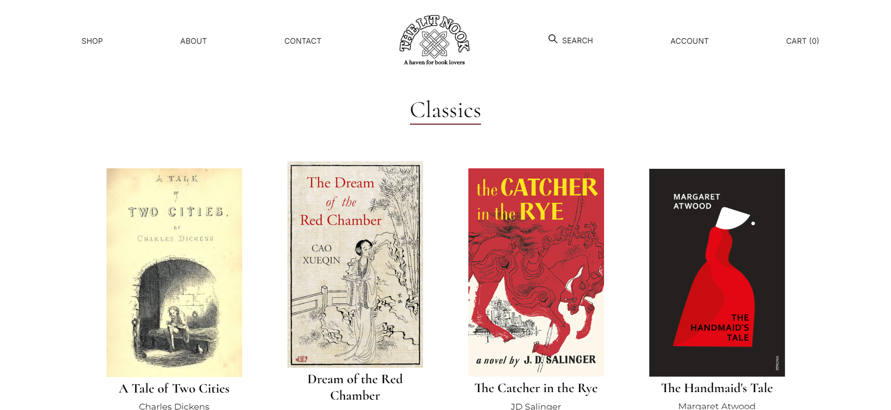
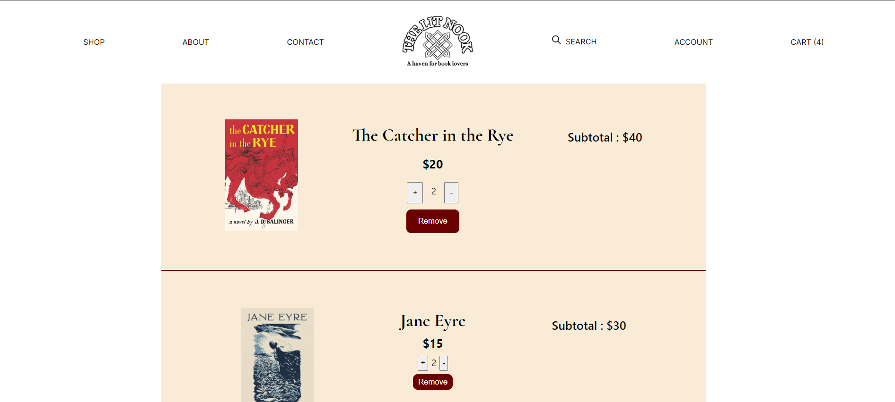
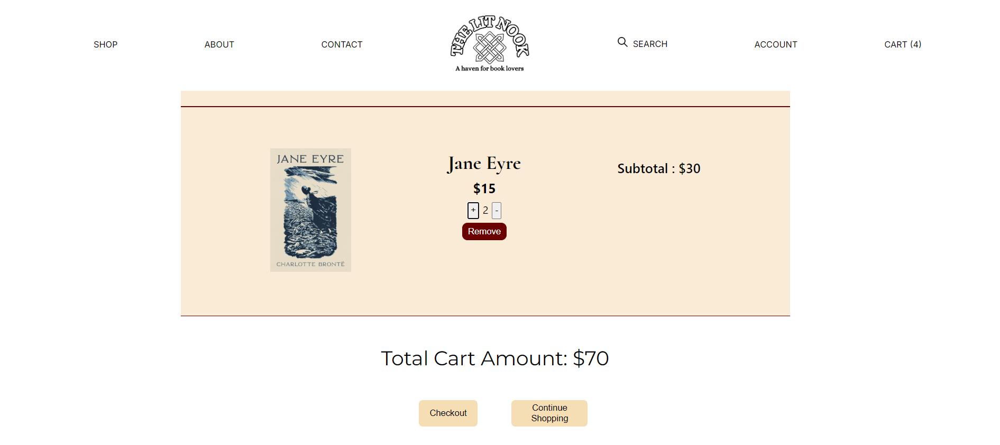

# The Lit Nook online book store

The Lit Nook site leverages React Redux to efficiently manage and share state across multiple pages, ensuring a seamless user experience. By storing cart items, book data, and user preferences in a centralized Redux store, different components can access and update shared data without unnecessary prop drilling. The site structure allows users to browse books, add items to their cart, and view their selections dynamically across pages.

Here's a link to the site : https://book-shopping-xi.vercel.app/

Here are a few screenshots from the project :

